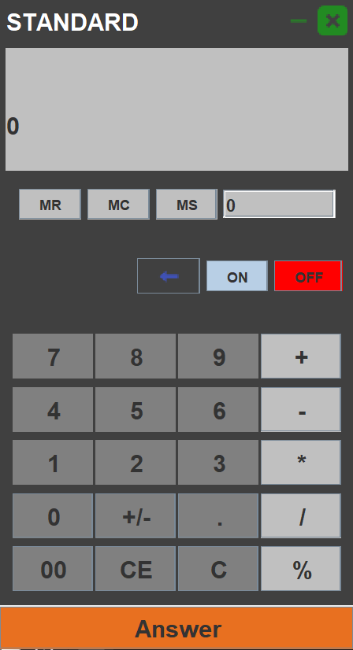

# 🧮 Java RMI-Based Calculator (2018 Class Project)

A simple calculator application built as a class project in 2018 using **Java Swing (JFrame)** for the graphical user interface and **Java RMI (Remote Method Invocation)** for remote computation.

---

## 📌 Description

This project showcases how to combine **Java GUI (Swing)** with **Java RMI** to build a distributed calculator application. It allows users to perform basic arithmetic operations via a graphical interface, while computations are handled remotely by an RMI server.

Originally created for an academic assignment, it demonstrates key Java concepts such as:

- GUI development with Swing
- Remote communication using RMI
- Separation of interface, client, and server logic

---

## 💡 Features

- Interactive calculator GUI (buttons, input panel)
- Supports basic operations: Addition, Subtraction, Multiplication, Division
- RMI-based server-client architecture
- Clean and modular code structure

---

---

## 🚀 How to Run

1. **Compile All Java Files**
   ```
   javac Interface/Calculator.java
   javac Server/CalculatorImpl.java
   javac Server/CalculatorServer.java
   javac Client/CalculatorForm.java

## 📸 Screenshot

## 🧾 UI Overview

The calculator features a clean and functional interface designed using **Java Swing (JFrame)** components. Below is a breakdown of the UI elements:

- **Title Bar**
  - Label: "STANDARD"
  - Custom minimize `[-]` and close `[X]` buttons

- **Display Panel**
  - A large text field to show current input or result
  - Secondary display for memory or additional data

- **Memory Buttons**
  - `MR`: Memory Recall  
  - `MC`: Memory Clear  
  - `MS`: Memory Store

- **Power & Control**
  - `ON`: Enables the calculator  
  - `OFF`: Disables input and clears display  
  - Backspace button: Deletes the last character  

- **Keypad**
  - Numeric Buttons: `0`–`9` and `00`
  - Operations: `+`, `-`, `*`, `/`, `%`
  - Decimal: `.`  
  - Sign Toggle: `+/-`

- **Clear Buttons**
  - `C`: Clear all input  
  - `CE`: Clear current entry  

- **Result Execution**
  - `Answer`: Executes the current operation and displays the result in the main output area

This UI provides a user-friendly, desktop-oriented experience for basic arithmetic, with support for memory operations and keyboard-style interaction.

